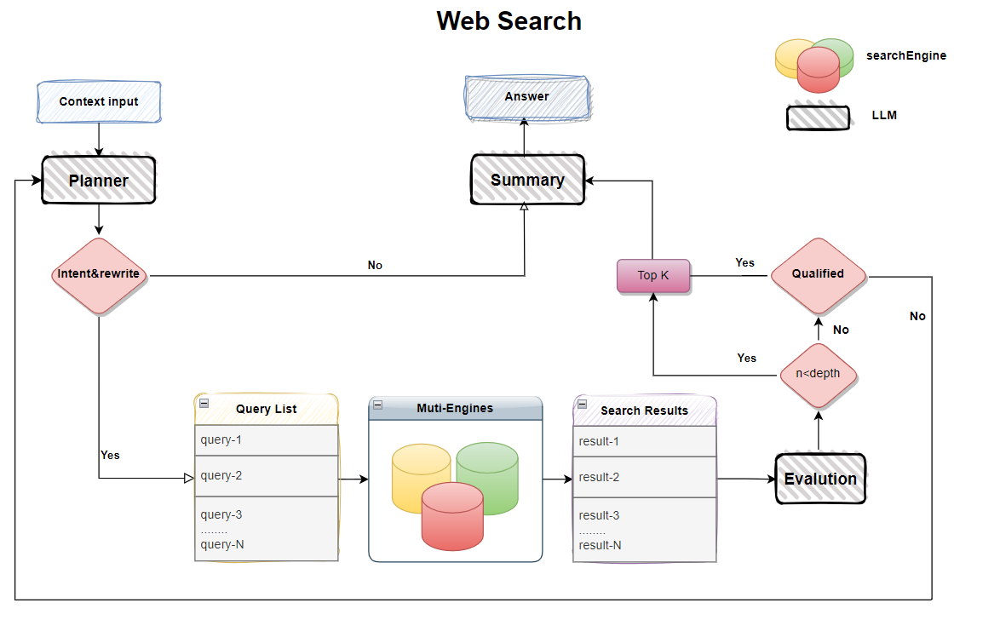

[](https://mseep.ai/app/positive666-deep-search-lightning)

# Deep Search Lighting


[](README_zh.md)

A lightweight, pure web search solution for large language models, supporting multi-engine aggregated search, deep reflection and result evaluation. A balanced approach between web search and deep research, providing a framework-free implementation for easy developer integration.

## ✨ Why deepsearch_lightning?

Web search is a common feature for large language models, but traditional solutions have limitations:
- Limited search result quality and reflection effectiveness
- Requires powerful models and paid search engines
- Small models often struggle with tool calling patterns
- Contextual understanding can be unstable across different model sizes

Deep Search Lighting provides:
- Framework-free implementation with no restrictions
- Works with free APIs while maintaining good query quality
- Adjustable depth parameters to balance speed and results
- Reflection mechanism for model self-evaluation
- Supports models of any size, including smaller ones

[Experimental Planning]:
- Simplified design without web parsing or text chunking
- Considering adding RL-trained small recall models


## ✨ Features

- Multi-engine aggregated search:
  - ✅ Baidu (free)
  - ✅ DuckDuckGo (free but requires VPN)
  - ✅ Bocha (requires API key)
  - ✅ Tavily (requires registration key)
  
- Reflection strategies and controllable evaluation
- Custom pipelines for all LLM models
- OpenAI-style API compatibility
- Pure model source code for easy integration
- Built-in MCP server support

## 📺 DEMO
  
## 🔄 Piepline
 

## 🚀 Quick Start

### 1. Installation
```bash
    conda create -n deepsearch_lightning python==3.11
    conda activate deepsearch_lightning
    pip install -r requirements.txt
    # Optional: For langchain support
    pip install -r requirements_langchain.txt
```
### 🔧Configuration
1. Rename .env.examples to .env
2. Fill in your model information (currently supports OpenAI-style APIs)
3. Baidu search is enabled by default - configure other engines as needed
### 🚀 RUN
```bash
        1. test case
                python test_demo.py
        2. streamlit demo
                streamlit run streamlit_app.py
        3. run mcp server
                python mcp_server.py 
                python langgraph_mcp_client.py
```

###  Planning
    
    🧪 RL-trained small recall QA model validation
    🧪 Strategy improvements
    🧪 Multi-agent framework implementation


🙌 Welcome to contribute your ideas! Participate in the project via [Issues] or [Pull Requests].

###  License
This repository is licensed under the [Apache-2.0 License](LICENSE).
